# Mahoraga MVP — A Junior Engineer's Guide

This guide explains the Mahoraga MVP from first principles. It is written for
an engineer who understands basic Java, APIs, and relational databases but has
not worked on this system before.

> **Authority note:** This is an educational companion, not a replacement for
> the specifications. If wording differs, `mahoraga-mvp.md` defines product
> behavior, `mahoraga-mvp-implementation-plan.md` defines build decisions, and
> the current file under `tasks/` defines one implementation session's scope.
> `mahoraga-design.md` describes the larger production direction.

The diagrams use Mermaid. GitHub and many Markdown viewers render Mermaid as
pictures. The text immediately below each diagram explains the same idea if
your editor does not render it.

## How to use this guide

You do not need to memorize all 29 sections at once.

| If you want to understand... | Read |
|---|---|
| Why Mahoraga exists and what the MVP proves | Sections 1–3 |
| The Java stack, startup, and package layout | Sections 4–6 |
| Events, hashing, transactions, and PostgreSQL | Sections 7–10 |
| Asset identity, finding identity, and test coverage | Sections 11–13 |
| Completion, knowledge boundaries, time, and folding | Sections 14–17 |
| The six stories, planner experiment, and report contrast | Sections 18–20 |
| Replay, testing, demo execution, and task order | Sections 21–24 |
| Invariants, mistakes to avoid, roadmap, and glossary | Sections 25–29 |

For a first pass, read Sections 1–3, 9–20, and 25–26. Return to the stack and
testing sections when you start an implementation task.

---

## 1. The problem in plain English

Imagine a security team that tests a customer, writes useful findings in a
notebook, finishes the engagement, and then throws the notebook away.

When the team returns three months later, it has to rediscover:

- Which systems existed.
- Which vulnerabilities were open.
- Which vulnerabilities had actually been retested.
- Which negative results were trustworthy.
- Which fixes later regressed.
- Which checks were most valuable to run first.

That is the problem Mahoraga addresses.

**Mahoraga is a durable memory system for repeated security engagements.** It
remembers stable targets, stable findings, and exact test coverage across time.
It can then use that memory both to explain what changed and to improve the next
test plan.

The MVP asks two central questions:

1. Can memory classify Engagement 2 honestly using what happened in Engagement
   1?
2. Can Engagement 1 memory change the Engagement 2 plan before any Engagement 2
   result exists?

Throughout this guide:

- **E1** means Engagement 1.
- **E2** means Engagement 2.
- An **engagement** is one bounded security-testing period.
- A **fact** is an immutable observation such as a detection or test attempt.

### The business value

Without memory, each engagement is an independent point-in-time scan. With
memory, the product can provide continuous, longitudinal security:

- It can say that a previously fixed weakness came back.
- It can distinguish “verified resolved” from “not seen.”
- It can warn that a known weakness was not retested.
- It can prioritize checks based on relevant prior history.
- Every repeat engagement can become more informed than the previous one.

That is the value behind a recurring engagement or retainer model.

---

## 2. What the MVP must prove

The MVP is successful only if executed application behavior proves all of the
following:

1. The same Kubernetes Deployment is recognized after Pod UID, Pod name, and IP
   address changes.
2. The same finding is recognized across engagements without receiving an
   internal finding ID from the fixture.
3. A weak identity collision is marked `AMBIGUOUS` and changes no posture.
4. A finding receives exactly one correct E2 episode classification:
   `NEW`, `STILL_OPEN`, `VERIFIED_RESOLVED`, `REGRESSED`, `NOT_RETESTED`, or
   `INCONCLUSIVE`.
5. Missing, failed, partial, or incompatible testing never proves a fix.
6. Memory moves the relevant regression check from action three to action one.
7. The same E2 facts produce an ordinary stateless view and a richer
   memory-aware view.
8. Duplicate ingestion, conflicts, rollback, gaps, replay, and shuffled input
   behave deterministically.

The exact final proof is:

```text
Candidate tests: [T-A, T-B, T-C]
Memory disabled: [T-A, T-B, T-C]
Memory enabled:  [T-C, T-A, T-B]
Actions before regression detection: 3 -> 1

Stable identity:
  Pod UID/name/IP changed: true
  Canonical Deployment unchanged: true
  Weak-signal collision: AMBIGUOUS
  Posture changes from ambiguous observation: 0

Stateless E2 view:
  Detected: 3
  Not detected: 1
  Partial: 1
  Findings with no E2 fact: unrepresentable
  Longitudinal classifications: unavailable

Memory-aware E1 + E2 view:
  NEW: 1
  STILL_OPEN: 1
  VERIFIED_RESOLVED: 1
  REGRESSED: 1
  NOT_RETESTED: 1
  INCONCLUSIVE: 1

Correctness:
  Duplicate retry: NO_OP
  Conflicting duplicate: REJECTED
  Missing completion sequence: REPORT_BLOCKED
  Shuffled ingestion report hash equal: true
  Transaction failure leaves partial state: false
```

These values must be calculated from persisted execution. The demo must not
print hard-coded “success” values.

---

## 3. The MVP system at a glance

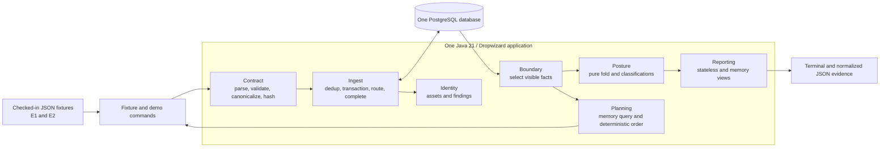

Figure 1 shows the entire MVP:

- Checked-in synthetic events stand in for a future Armadin adapter.
- One Java application contains several capability packages.
- PostgreSQL stores all durable MVP state.
- The planner returns an order to the fixture runner.
- The reporting path produces human-readable and machine-readable proof.

The boxes inside the application are **packages and responsibilities**, not
microservices. The MVP creates one Maven module and one executable application
artifact.

### What is deliberately not in this picture

The MVP does not include:

- A live Kubernetes cluster.
- A customer-facing REST API or web UI.
- Spanner, Dataflow, or Pub/Sub.
- A Python service.
- An LLM in the planner.
- Cross-tenant learning.
- Tradecraft memory.
- `maho-gate`.
- A hosted deployment.
- Production high availability, disaster recovery, or load testing.

---

## 4. The complete technology stack

| Concern | Technology | Why it is here |
|---|---|---|
| Language | Java 21 | Records and enums make contracts explicit; the user can review Java quickly |
| Build | Maven Wrapper, one module | Reproducible commands without requiring a globally matching Maven version |
| Application | Dropwizard 5.x | Configuration, CLI commands, lifecycle, logging, health, and packaging |
| Dependency injection | Guice 7 | Explicit construction and wiring without framework scanning |
| Configuration | Dropwizard YAML + Jakarta Validation | Typed startup configuration that fails early when invalid |
| JSON | Dropwizard-managed Jackson | Strict mapping from versioned JSON to typed Java records |
| SQL access | Dropwizard JDBI3 | Small, explicit SQL collaborators and transaction control |
| Database | PostgreSQL | Real relational constraints, transactions, JSONB, and production-relevant behavior |
| Migrations | Flyway SQL migrations | One ordered owner of database schema changes |
| Hashing | JDK SHA-256 | Deterministic event, boundary, fixture, fact, and report digests |
| Logging | SLF4J + Logback | Parameterized application logging through Dropwizard |
| Unit tests | JUnit 5 | Pure contract, fold, planner, and rendering tests |
| Application tests | Dropwizard Testing | Startup, command, configuration, and lifecycle verification |
| Database tests | Testcontainers PostgreSQL | Tests real PostgreSQL semantics instead of pretending H2 is equivalent |
| Packaging | Maven Shade | One executable JAR |
| Demo database | Guarded `docker run` | Repeatable local PostgreSQL without requiring Docker Compose |

### Why Java instead of Python?

The hardest MVP problems are:

- Transaction correctness.
- Stable identity.
- Deterministic ordering.
- Versioned contracts.
- Replay.
- Lifecycle state.

Java's type system, records, enums, and mature PostgreSQL test tooling fit those
risks well. The user is also more comfortable reviewing Java.

Future Armadin integration is isolated behind versioned JSON `SourceEvent`
fixtures. If production must be Python-native, those fixtures and golden tests
become an executable specification for an adapter or port. The MVP does not add
a Java/Python hybrid before that requirement is known.

### Technologies intentionally avoided

The MVP does not use:

- Spring or Spring Boot.
- JPA, Hibernate, or another ORM.
- H2.
- Lombok.
- MapStruct.
- A generic DAO/repository framework.
- An event-sourcing framework.
- An internal event bus.
- Reactive database access.
- Guice classpath scanning.
- Multiple Maven modules.
- Docker Compose.

The theme is simple: use direct Java, direct SQL, and explicit composition.

---

## 5. How the application starts

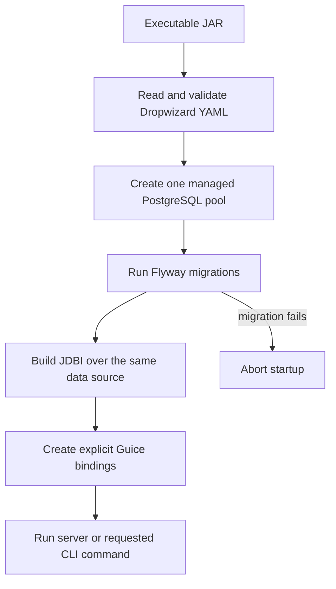

Important details:

- There is exactly one managed connection pool in one application process.
- Flyway and JDBI use the same Dropwizard-managed data source.
- Flyway runs before application SQL can use the schema.
- A migration failure stops startup.
- Database-free commands such as packaged `--help` must not construct or require
  a database connection.
- Guice uses explicit bindings and constructor injection. It does not scan the
  classpath for magic bindings.

---

## 6. Expected package ownership

The code lives under:

```text
dev.mahoraga.memory
```

A simplified target layout is:

```text
src/main/java/dev/mahoraga/memory/
├── MahoragaApplication.java
├── config/         # typed application config and explicit Guice composition
├── contract/       # SourceEvent types, parsing, validation, canonical hashing
├── database/       # database bootstrap and narrowly shared database support
├── ingest/         # inbox, stream binding, transaction, event routing
├── identity/       # canonical Deployment identity
├── finding/        # stable finding identity and occurrences
├── coverage/       # test attempts and coverage compatibility
├── boundary/       # engagement completion and visible-fact selection
├── posture/        # pure longitudinal fold
├── planning/       # memory features and deterministic planner
├── reporting/      # stateless/memory reports and semantic digests
├── fixture/        # synthetic datasets and runner-only manifest
├── demo/           # executed proof collection and semantic evidence
└── commands/       # guarded local demo command
```

These ownership rules matter:

- Parsing should not know SQL.
- Pure posture code should not know JDBI or Dropwizard.
- SQL code should not decide report wording.
- Fixture labels must not enter production domain models.
- Shell scripts may orchestrate commands but must not calculate classifications,
  hashes, or planner metrics.
- A package boundary is not automatically an interface. One concrete
  implementation is preferred until a second implementation really exists.

---

## 7. The input contract

Mahoraga accepts one internal event envelope:

```json
{
  "source_event_id": "source-e1-001",
  "event_type": "asset_observation",
  "source_stream_id": "stream-e1",
  "source_sequence": 1,
  "schema_version": 1,
  "occurred_at": "2026-01-01T10:00:00Z",
  "payload": {
    "cluster_id": "cluster-demo",
    "resource_kind": "Deployment",
    "resource_uid": "deployment-uid-123",
    "pod_uid": "pod-uid-old",
    "pod_name": "api-7d9f-old",
    "ip_address": "10.0.0.10"
  }
}
```

Its Java shape is:

```text
SourceEvent {
  String sourceEventId
  EventType eventType
  String sourceStreamId
  long sourceSequence
  int schemaVersion
  Instant occurredAt
  SourcePayload payload
}
```

The fixture runner or future trusted adapter supplies separate context:

```text
TrustedContext {
  String tenantId
  String engagementId
}
```

`tenant_id` and `engagement_id` are not accepted from arbitrary payload JSON.
They come from a trusted boundary and are also not part of the source hash.
Durable stream binding prevents the same stream from being moved to another
tenant or engagement.

### The four event types

| Event type | What it means | Main durable result |
|---|---|---|
| `asset_observation` | “I observed this Deployment and these current Pod/network details” | `asset_observations`, and possibly a canonical `assets` row |
| `finding_observation` | “This weakness was detected on this authoritative Deployment” | Stable `findings` row plus a `finding_occurrences` fact |
| `test_attempt` | “This exact check was attempted with this result/status” | `test_attempts` coverage fact |
| `engagement_completed` | “The producer says data positions through N belong to this engagement” | Finalized `engagements.last_data_sequence` only after gap verification |

The parser uses the explicit `event_type`. It never guesses the type by looking
for arbitrary fields inside `payload`.

### Strict validation

Schema version 1:

- Rejects unknown fields.
- Rejects duplicate JSON keys.
- Rejects unsupported event types.
- Requires positive source sequences.
- Limits input size and JSON nesting.
- Requires timestamps that fit PostgreSQL microsecond precision.
- Rejects illegal status/result combinations.
- Does not silently coerce invalid enum values.

Internal code can stay simple because invalid external input is rejected at the
boundary.

---

## 8. Canonical JSON and the server-computed hash

Equivalent JSON can be formatted in many ways:

```json
{"a":1,"b":2}
```

and:

```json
{
  "b": 2,
  "a": 1
}
```

Mahoraga needs these to mean the same thing when the typed content is the same.
It therefore creates one canonical byte representation with fixed field order,
sorted map keys, stable time formatting, and no insignificant whitespace.

It then computes:

```text
canonical_source_hash = SHA-256(canonical source-event bytes)
```

The fixture never supplies a trusted hash. Mahoraga computes it after strict
parsing and validation.

Canonicalization is versioned. A deployment must not change schema-version-1
canonicalization, because an old retry could otherwise look like conflicting
new content after an upgrade.

### Idempotency and conflict rules

| Existing durable state | New input | Result |
|---|---|---|
| No matching event or stream position | Valid new event | `ACCEPTED` |
| Same tenant + same event ID + same canonical hash | Exact retry | `NO_OP` |
| Same tenant + same event ID + different hash | Changed retry | Reject conflict |
| Same tenant + same stream/sequence + different event | Position reuse | Reject conflict |
| Stream already belongs to another tenant/engagement | Context substitution | Reject conflict |

The source hash supports deterministic retry/conflict behavior. It does **not**
claim externally anchored or hash-chained provenance; that is future production
work.

---

## 9. End-to-end ingestion

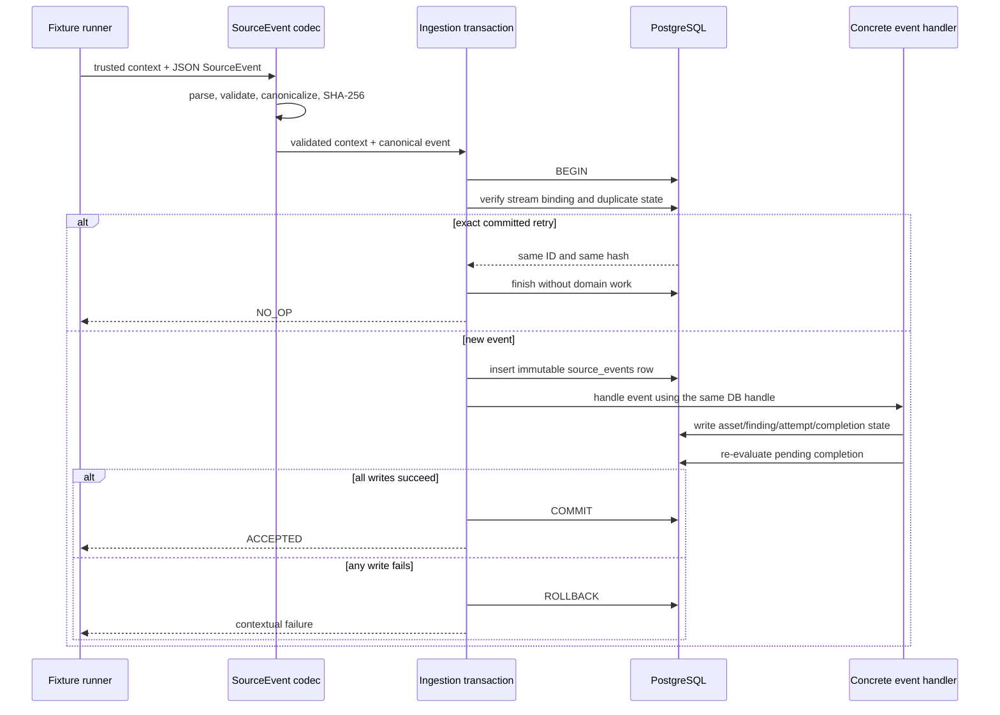

The ingestion algorithm is deliberately synchronous and direct:

1. Parse, validate, canonicalize, and hash outside the transaction.
2. Open one JDBI transaction.
3. Insert or verify the engagement/stream binding.
4. Check event-ID and stream-position uniqueness.
5. Return `NO_OP` for an exact committed retry.
6. Insert the immutable `source_events` row.
7. Use one exhaustive four-case Java switch to call the concrete event handler.
8. Write all derived rows using the same JDBI `Handle`.
9. Re-evaluate engagement completion.
10. Commit once.

The transaction callback performs deterministic database work only. It cannot
call the network, write files, publish messages, or perform another external
side effect. Otherwise the database might roll back while the external effect
remains.

### Why atomicity matters

Suppose Mahoraga inserts the source event and then fails while inserting its
finding occurrence. If the source row committed alone, a retry would look like
a duplicate and the missing occurrence might never be repaired.

The invariant is:

```text
source event + every derived write = one commit or one rollback
```

After rollback, a retry sees no committed source event and can run once. After a
successful commit, an exact retry becomes `NO_OP` and does not duplicate facts.

---

## 10. The seven-table database model

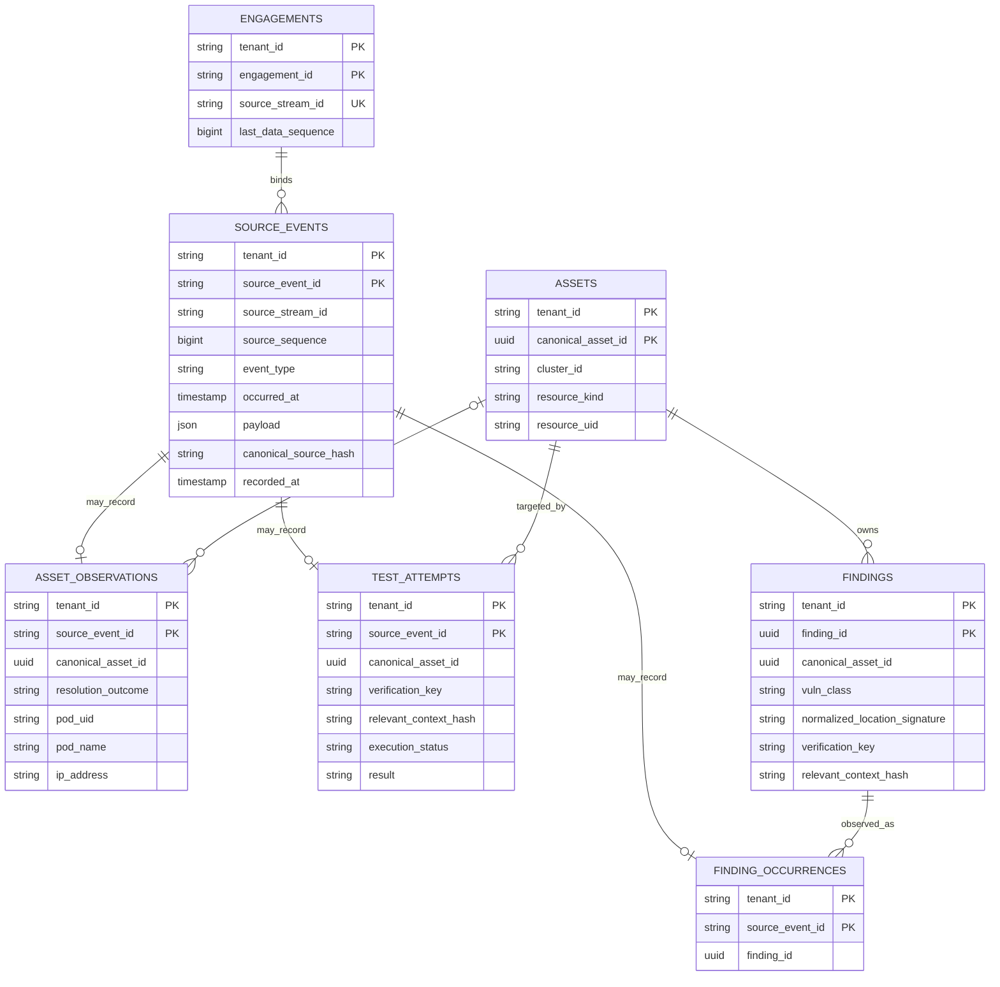

### What each table owns

#### `engagements`

Binds one globally unique source stream to one tenant and engagement. Its
nullable `last_data_sequence` is the durable “this stream is complete through
N” value. Null means the engagement is not finalized.

#### `source_events`

Acts as both:

- The immutable source log.
- The inbox/deduplication ledger.

Chronology, engagement, stream position, raw payload, server hash, and
operational recorded time live here.

#### `assets`

Stores stable, confirmed Kubernetes Deployment identities. Every MVP asset has
an authoritative resource UID; the MVP does not create provisional assets.

#### `asset_observations`

Stores changing evidence such as Pod UID, Pod name, IP, DNS, labels, and banner.
It also stores whether identity resolution was `RESOLVED` or `AMBIGUOUS`.

#### `findings`

Stores stable weaknesses that can survive from E1 to E2. It contains the
identity key and the verification baseline needed for later coverage matching.

#### `finding_occurrences`

Stores positive detection facts: “this stable finding was observed in this
source event.”

A finding is the long-lived weakness. An occurrence is one detection of it.

#### `test_attempts`

Stores what was actually tested, including negative, failed, blocked, partial,
or skipped attempts. This table prevents “we did not see it” from being confused
with “we tested it correctly and did not detect it.”

### Important database rules

- Every tenant-owned primary key, foreign key, and query includes `tenant_id`.
- Fact tables link to `source_events` instead of duplicating engagement and time
  columns.
- PostgreSQL constraints are the final guard against illegal cross-tenant
  references, duplicate stream positions, and illegal status/result pairs.
- Status values use checked text rather than PostgreSQL enums so later
  vocabulary changes are explicit migrations rather than hidden type coupling.
- The core MVP has exactly seven domain tables. It does not implement the larger
  production `DomainEvent`, outbox, provenance, projection, aggregate-head, or
  report-version model.

---

## 11. Stable asset identity

The canonical MVP asset is a Kubernetes **Deployment**:

```text
(tenant_id, cluster_id, resource_kind = Deployment, resource_uid)
```

Pods, Pod names, and IPs are observations. They are expected to change.

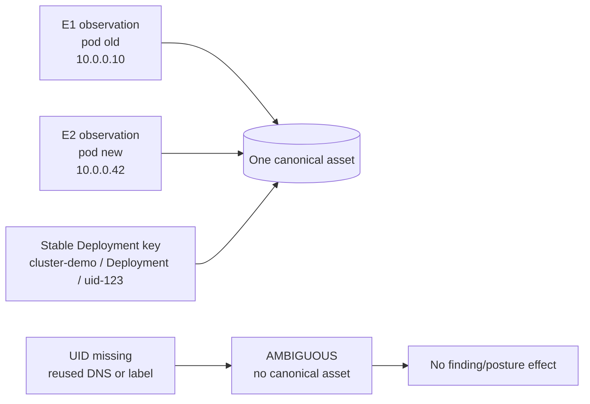

This gives the desired behavior:

```text
same Deployment UID + changed Pod UID/name/IP = same canonical asset
```

### Authoritative and weak identity paths

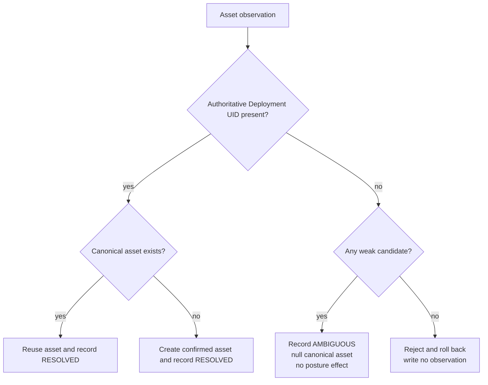

The production taxonomy has more outcomes, but the core MVP persists only:

- `RESOLVED`
- `AMBIGUOUS`

It does not persist `CREATED_PROVISIONAL` or `REJECTED`.

Weak signals may identify candidates, but they never silently merge resources.
If an authoritative UID is present, the authoritative identity wins.

---

## 12. Stable finding identity

A finding is identified by:

```text
(tenant_id,
 canonical_asset_id,
 vuln_class,
 normalized_location_signature,
 match_key_version = 1)
```

For example, a SQL injection finding on one normalized route of one stable
Deployment should remain the same finding when its Pod is replaced.

A `finding_observation` carries:

- The authoritative Deployment key.
- Vulnerability class.
- Normalized location signature.
- Verification/check key.
- Check version.
- Relevant context.
- Compatibility policy version.

It does **not** carry:

- Internal `canonical_asset_id`.
- Internal `finding_id`.
- An `F-*` demo scenario label.

Mahoraga resolves the stable asset, inserts or rereads the stable finding, and
then appends a `finding_occurrence`.

The database uniqueness constraint makes repeated and shuffled observations
converge on one finding.

### Detection and coverage are separate facts

A finding occurrence means:

> The weakness was detected.

A test attempt means:

> This check ran, or tried to run, with this status and result.

A detected test attempt does not invent a finding occurrence. The fixture
contains both facts when both are required. Keeping them separate makes coverage
honest and allows attempts to arrive before finding observations.

---

## 13. Coverage: why “not seen” is not “fixed”

A negative result only answers the exact question that was tested.

Mahoraga compares a test attempt to a finding's verification baseline:

```text
is_compatible =
    same tenant
    AND same canonical asset
    AND same verification key
    AND exact check version
    AND exact relevant-context hash
    AND compatibility policy version = 1
```

Only this combination verifies resolution:

```text
compatible
AND execution_status = completed
AND result = not_detected
```

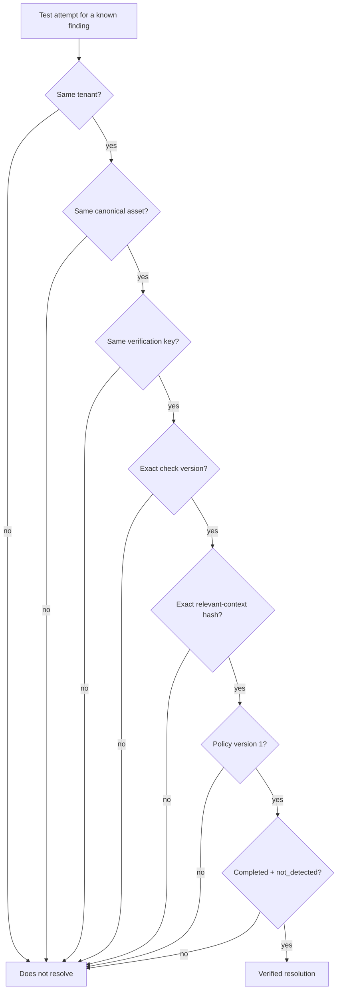

The relevant context includes:

- Protocol.
- Port.
- Normalized route.
- Security-relevant check parameters.
- Exact address only when the check is explicitly address-bound.

For an ordinary Deployment-level check, ephemeral Pod names and IP addresses
are excluded. That allows a meaningful retest after Pod churn.

| Changed dimension | Compatible for a Deployment-level check? |
|---|---|
| Pod UID | Yes |
| Pod name | Yes |
| Ephemeral Pod IP | Yes |
| Port | No |
| Normalized route | No |
| Security-relevant parameter | No |
| Check version | No |
| Verification key | No |
| Canonical Deployment | No |
| Policy version | No |

These never resolve a finding:

- Failed.
- Blocked.
- Partial.
- Skipped.
- Missing/absent.
- Inconclusive.
- Incompatible.
- Completed detection.

The MVP records a negative verification. It does not claim to know that a human
remediated the system.

---

## 14. Engagement completion

Each engagement uses one ordered source stream:

```text
data events:       1, 2, 3, ... N
completion event:  N + 1
marker says:       last_data_sequence = N
```

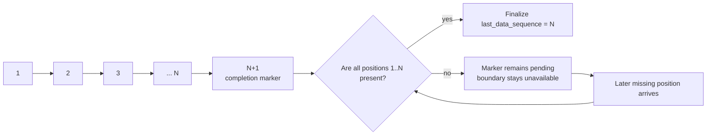

A completion marker alone does not prove completeness.

Rules:

- If every data position `1..N` exists, the marker transaction finalizes the
  engagement.
- If an earlier position is missing, the marker may be stored as pending while
  `engagements.last_data_sequence` remains null.
- When the missing position later arrives, that transaction rechecks and can
  finalize without replaying the marker.
- Data beyond the declared marker is rejected.
- After finalization, new events are rejected.
- An exact retry still returns `NO_OP`.
- Restart recovery uses persisted source rows and the marker. There is no
  in-memory pending map or background scanner.

This prevents a report from pretending an incomplete stream is complete.

---

## 15. Knowledge boundaries: the “as-of” rule

A knowledge boundary says exactly which durable source positions a query may
see:

```text
KnowledgeBoundary = sorted set of
    (source_stream_id, last_data_sequence)
```

For example:

```json
{
  "positions": [
    {
      "source_stream_id": "stream-e1",
      "last_data_sequence": 7
    },
    {
      "source_stream_id": "stream-e2",
      "last_data_sequence": 9
    }
  ]
}
```

A fact is visible only if:

```text
same trusted tenant
AND its stream appears in the boundary
AND its source_sequence <= that stream's limit
```

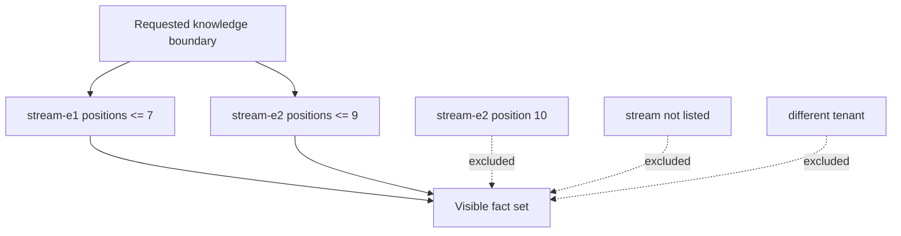

Boundary filtering happens before chronological ordering. A fact that arrives
later with an old `occurred_at` remains invisible to an earlier boundary.

There is no “just use latest” overload. The planner and report must state their
boundary explicitly.

### Three important boundaries

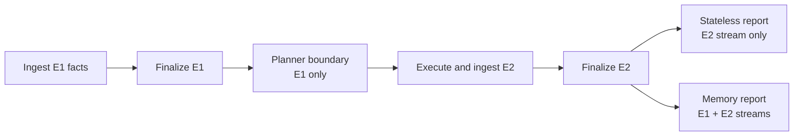

- **Planner boundary:** finalized E1 only, before any E2 outcome.
- **Stateless report boundary:** E2 only.
- **Memory report boundary:** E1 plus E2.

This one mechanism prevents future-data leakage and enables the fair report
comparison.

---

## 16. Time and deterministic ordering

For the fixture MVP:

```text
effective_at = validated occurred_at
```

Boundary-selected facts are ordered by:

```text
(effective_at, source_stream_id, source_sequence, source_event_id)
```

`recorded_at` means “when Mahoraga wrote the row.” It is useful operational
metadata, but it never decides historical posture.

Why?

Events can arrive late or out of order. If insertion time controlled history,
the same facts could produce different results after a replay. Domain chronology
plus deterministic tie-breakers ensures equal facts yield equal results.

The MVP proves convergence for sequential shuffled input. It does not claim
fully concurrent production ingestion safety.

---

## 17. The pure posture fold

The posture fold is a pure function:

```text
boundary-selected ordered facts + explicit current engagement
    -> longitudinal finding result
```

It does not read:

- The database.
- The current clock.
- Environment variables.
- Random values.
- Fixture labels.

For each stable finding, the result has three separate dimensions:

| Dimension | Meaning | Values |
|---|---|---|
| Last verified exposure | Best durable truth carried across engagements | `OPEN`, `VERIFIED_RESOLVED` |
| Current assessment | What the current engagement established | `DETECTED`, `NOT_DETECTED`, `NOT_RETESTED`, `INCONCLUSIVE` |
| Episode classification | What changed in the current engagement | Six classifications below |

Separating these dimensions avoids destructive simplifications. For example,
`NOT_RETESTED` does not erase a last-known-open exposure.

### Exposure-state picture

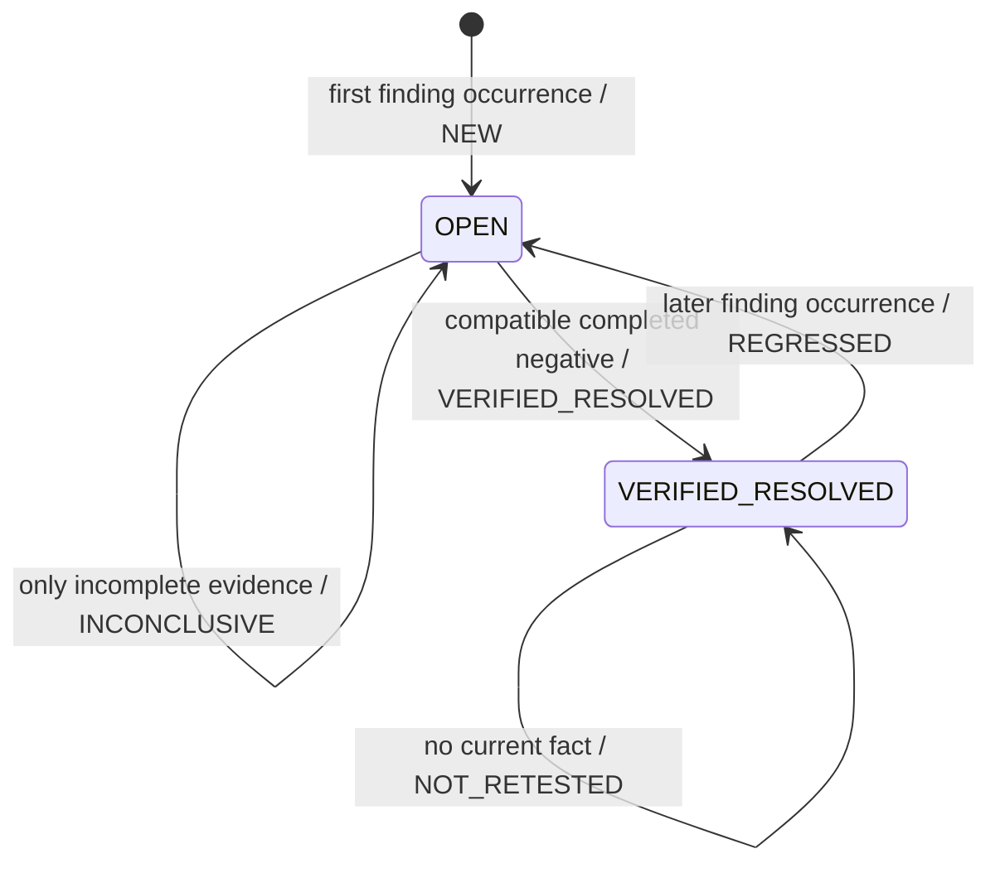

The transition label after `/` is the current episode classification. Current
assessment is still reported separately.

### Classification precedence

The fold applies this precedence once:

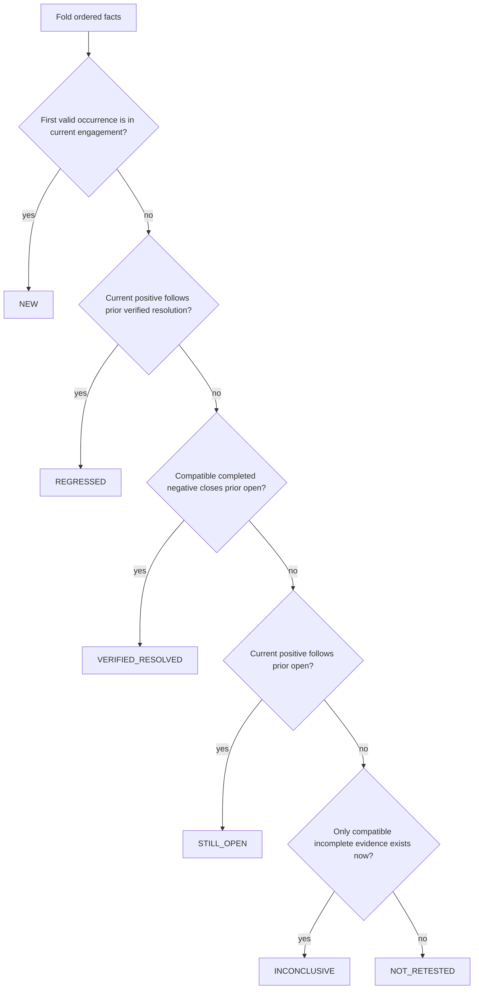

The six mutually exclusive classifications are:

| Classification | Junior-friendly meaning |
|---|---|
| `NEW` | This is the first valid detection of the stable finding |
| `REGRESSED` | It was previously verified resolved, but is detected again |
| `VERIFIED_RESOLVED` | It was open, and an exact compatible completed negative now closes it |
| `STILL_OPEN` | It was open and is detected again |
| `INCONCLUSIVE` | Current testing exists but cannot prove detected or not detected |
| `NOT_RETESTED` | No current occurrence or compatible attempt exists |

Only facts from the explicit current engagement raise current episode flags.
An old closure or regression must not leak into a later episode.

---

## 18. The six fixture stories

The demo creates six understandable histories:

| Runner label | E1 history | State at planner boundary | E2 history | E2 classification | Why |
|---|---|---|---|---|---|
| `F-STILL` | Detected | Open | Detected | `STILL_OPEN` | A known open weakness appears again |
| `F-FIXED` | Detected | Open | Compatible completed negative | `VERIFIED_RESOLVED` | E2 actually reran the same check and did not detect it |
| `F-REGRESS` | Detected, then compatibly verified resolved | Verified resolved | Detected | `REGRESSED` | A previously closed weakness returned |
| `F-UNTESTED` | Detected | Open | No E2 fact | `NOT_RETESTED` | Memory knows the subject existed and E2 did not cover it |
| `F-INCONCLUSIVE` | Detected | Open | Partial/failed compatible attempt | `INCONCLUSIVE` | Testing happened, but it cannot establish closure |
| `F-NEW` | Absent | No prior finding | First E2 detection | `NEW` | The weakness first appears in E2 |

The `F-*` names exist only in runner metadata and test assertions. They never
appear in:

- Source-event payloads.
- Core identity models.
- Planner input.
- Production report semantics.

They make the synthetic scenario readable without giving the application the
answer.

---

## 19. The planner experiment

Storage alone is not the product differentiator. The important proof is that
memory changes the next plan.

### Planner input

The planner receives:

```text
CandidateTest(candidate_id, authoritative_deployment_key, verification_key)
PlannerRequest(
    tenant_id,
    candidates,
    action_budget,
    explicit_knowledge_boundary,
    memory_features
)
MemoryFeature(candidate_id, has_prior_verified_resolution)
```

It must not receive:

- `F-*` scenario labels.
- Frozen E2 outcomes.
- E2 events.
- Eventual E2 classifications.
- A field containing the expected order.

### Memory query

For each candidate, the memory query:

1. Uses the trusted tenant.
2. Resolves the exact authoritative Deployment target.
3. Selects matching findings by verification key.
4. Folds only facts visible at the E1 boundary.
5. Sets `has_prior_verified_resolution = true` only if the folded last exposure
   still equals `VERIFIED_RESOLVED`.

An old negative followed by a later detection does not count as still resolved.
A matching verification key on another asset or tenant contributes nothing.

### Deterministic ordering

```text
memory off:
    candidate_id ascending

memory on:
    has_prior_verified_resolution descending,
    candidate_id ascending
```

No LLM, random score, configurable weight, severity model, or future outcome is
involved.

### Two controlled experiment arms

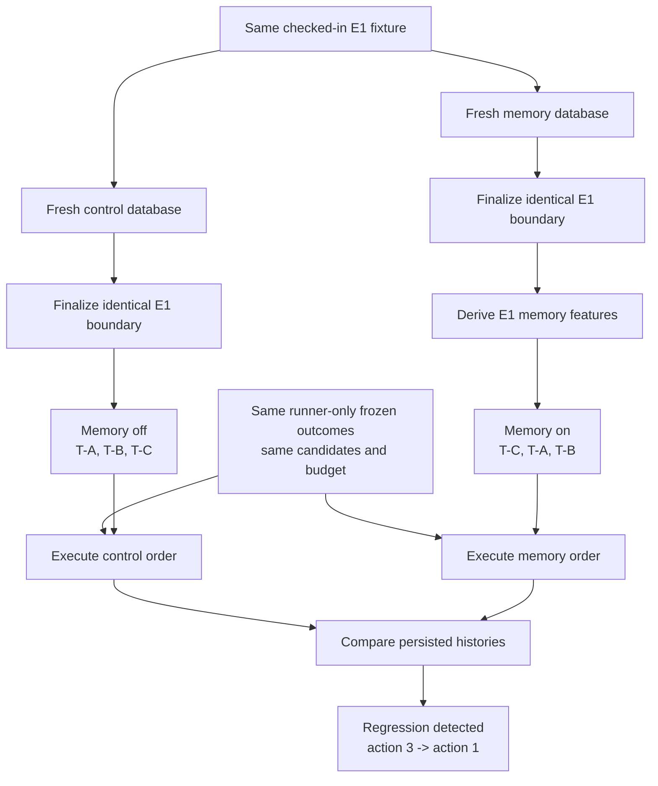

The candidate mapping is:

| Candidate | Runner-only action | Frozen result | Story |
|---|---|---|---|
| `T-A` | Check prior-open target | Detected | `F-STILL` |
| `T-B` | Check prior-open target | Completed, not detected | `F-FIXED` |
| `T-C` | Recheck prior verified-resolved target | Detected | `F-REGRESS` |

The control and memory arms run sequentially against separate clean databases.
One application process owns one pool and one database at a time.

The metric is derived after persisted execution by linking the regression
detection to the candidate action that caused its source event. It is not an
asserted fixture constant or a predicted planner score.

---

## 20. Stateless report versus memory report

After E2 is finalized, Mahoraga renders the same E2 semantic facts through two
knowledge scopes:

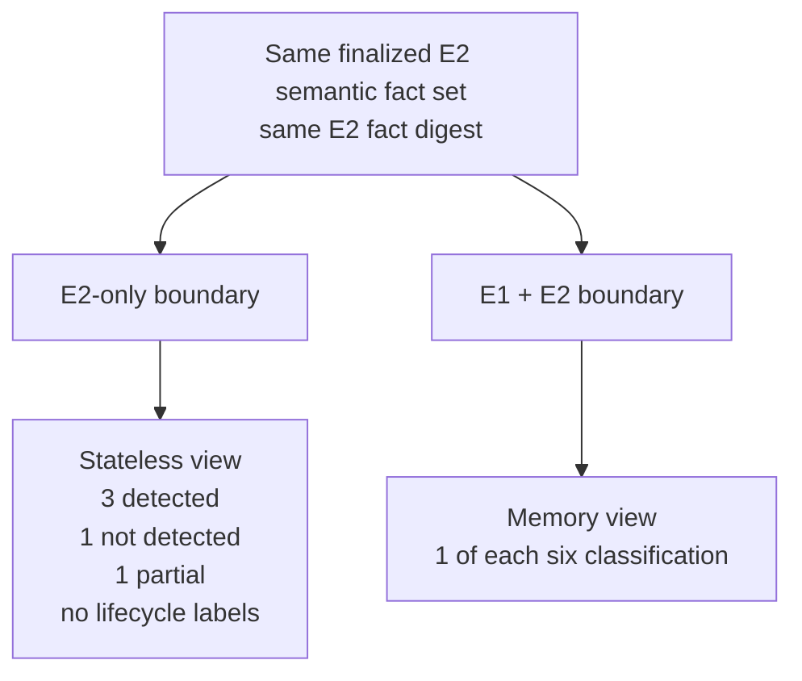

### Stateless E2-only result

The point-in-time view sees:

- Three detections: the still-open, regressed, and new cases all look merely
  detected.
- One completed not-detected attempt.
- One partial attempt.
- No fact at all for `F-UNTESTED`.

Therefore the exact stateless summary is:

```text
Detected: 3
Not detected: 1
Partial: 1
Findings with no E2 fact: unrepresentable
Longitudinal classifications: unavailable
```

`F-UNTESTED` is not a second “not found.” Without E1, the stateless view cannot
even know that subject exists.

### Memory-aware E1 + E2 result

With prior memory in scope:

```text
NEW: 1
STILL_OPEN: 1
VERIFIED_RESOLVED: 1
REGRESSED: 1
NOT_RETESTED: 1
INCONCLUSIVE: 1
```

The same E2 fact digest backs both views. The difference comes from historical
scope, not from changing current evidence or running a second code path.

This proves three things a stateless scan structurally cannot provide:

1. Regression detection.
2. Verified-resolution semantics.
3. Honest missing-retest coverage.

---

## 21. Determinism, replay, and rebuild

Mahoraga must produce the same semantic answer from the same facts.

### Duplicate replay

Replaying every exact source event:

- Returns `NO_OP`.
- Adds no duplicate observation, occurrence, or attempt.
- Does not change a completed boundary.

### Shuffled arrival

The fixtures are ingested in multiple deterministic sequential orders. After
boundary filtering and domain ordering, the report must be semantically equal.

This proves sequential arrival-order independence. It does not prove arbitrary
concurrent ingestion.

### Rebuild

A rebuild rereads recorded facts and identities:

- It does not rerun weak/fuzzy identity matching.
- It does not replace recorded asset or finding IDs in the same database.
- It derives the same report from the same facts.

Fresh databases may generate different internal UUIDs. Cross-database semantic
comparison therefore uses stable asset and finding key components rather than
random internal UUIDs.

### Semantic hashes

Canonical semantic data excludes values that should not change meaning:

- Generated timestamps.
- Request or trace IDs.
- Container IDs.
- Ports chosen for a local demo.
- Absolute paths.
- Random internal UUIDs where a stable semantic key exists.

Equal semantic inputs must produce equal evidence and report digests.

---

## 22. Testing strategy

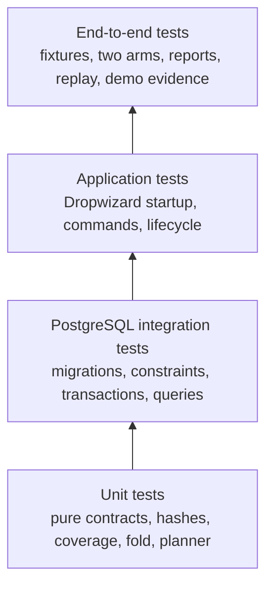

### Unit tests

Use unit tests for:

- Strict parsing and semantic validation.
- Canonical JSON and golden SHA-256 vectors.
- Coverage compatibility one-dimension mismatches.
- Pure posture folding and classification precedence.
- Planner validation and deterministic ordering.
- Report canonicalization and rendering.

### Real PostgreSQL integration tests

Use Testcontainers PostgreSQL for:

- Fresh and repeated Flyway migration behavior.
- Tenant-qualified foreign keys.
- Unique event and stream positions.
- Resolution outcome constraints.
- Legal test status/result pairs.
- Microsecond timestamp round-trips.
- Transaction rollback at each critical write point.
- Completion gaps and boundary queries.
- Identity convergence and planner memory queries.

H2 or mocked SQL cannot prove these PostgreSQL contracts.

### End-to-end tests

End-to-end tests prove:

- E1 and E2 fixture semantics.
- All six longitudinal classifications.
- Stable Deployment identity across churn.
- Ambiguity has no posture effect.
- Exact stateless and memory reports.
- Executed planner orders and the `3 -> 1` metric.
- Duplicate, conflict, gap, rollback, shuffle, and replay behavior.
- Byte-stable normalized demo evidence.

Required integration tests do not silently skip when Docker is unavailable.
Failure must be visible.

---

## 23. The local demo lifecycle

The final demo is built in two layers:

1. Java executes domain behavior and creates normalized evidence.
2. A guarded shell script manages local PostgreSQL lifecycles and presents the
   Java evidence.

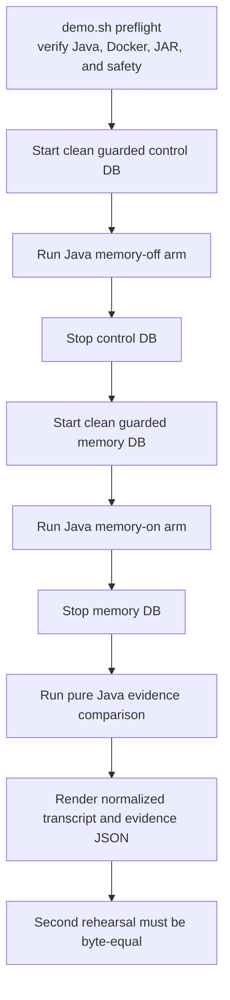

The shell safety guard verifies the exact synthetic container identity,
database name, label, image, loopback binding, command, restart/network policy,
and absence of mounts or volumes before cleanup.

The script does not parse domain rows or calculate:

- Classifications.
- Planner metrics.
- Semantic hashes.
- Report counts.

Those belong to Java application code and persisted evidence.

The later demo tasks add:

- A reviewed six-to-seven-minute script.
- Three rehearsals.
- A local H.264 MP4.
- Captions and transcript.
- Artifact SHA-256 and source/build fingerprint.

The video remains outside ordinary Git history.

---

## 24. How the implementation tasks fit together

The complete work is intentionally split into small reviewable sessions:

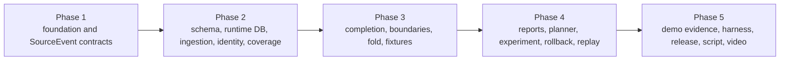

At a high level:

- TASK-001 and TASK-002 establish the reproducible Java application and trusted
  event contract.
- TASK-003A through TASK-007 build PostgreSQL, transactional ingestion, stable
  identities, and coverage.
- TASK-008A through TASK-010B add completeness, knowledge boundaries, pure
  posture, and synthetic proof data.
- TASK-011 through TASK-015 add reports, planning, the executed experiment,
  atomicity hardening, and replay.
- TASK-016A through TASK-019 create deterministic demo evidence, orchestration,
  clean-room handoff, script, and video.

The authoritative dependency graph and task status live in
`mahoraga-mvp-implementation-plan.md`. Each task file ends with a fresh-session
coding-agent prompt.

---

## 25. Critical invariants

These are the rules a junior engineer should be able to explain before changing
the critical path:

1. Every tenant-owned key and query is tenant-qualified.
2. Source event ID and source stream position are separate uniqueness
   contracts.
3. The canonical source hash is computed by Mahoraga, not trusted from input.
4. Source-event insertion and all derived writes commit or roll back together.
5. Transaction work has no external side effects.
6. Canonical Deployment identity is separate from changing Pod observations.
7. Weak identity never silently merges two assets.
8. Finding identity is stable across engagements.
9. A detected test attempt does not synthesize a finding occurrence.
10. Missing, failed, partial, skipped, or incompatible testing never proves
    resolution.
11. A completion marker is not final until all declared earlier positions exist.
12. Every historical query uses an explicit finalized knowledge boundary.
13. `occurred_at` drives domain chronology; `recorded_at` never does.
14. Facts and recorded identities are immutable inputs to deterministic reads.
15. The planner sees no E2 result or runner-only outcome data.
16. Both experiment arms begin from semantically identical finalized E1 state.
17. Stateless and memory reports use the same E2 semantic facts.
18. Equal facts must produce equal semantic reports regardless of arrival order.

---

## 26. Common misunderstandings

### “No E2 finding means it was fixed.”

False. It may not have been tested. A known E1 finding with no compatible E2
attempt becomes `NOT_RETESTED` in the memory view.

### “Not detected means remediated.”

False. Mahoraga records a compatible negative verification. It does not claim
who changed the system or whether a remediation action occurred.

### “The Pod is the asset.”

False. The canonical MVP asset is the Deployment. Pods, Pod names, and IPs are
changing observations.

### “Any negative test closes a finding.”

False. Tenant, asset, verification key, check version, relevant context, policy,
status, and result must all match.

### “A completion marker means the stream is complete.”

False. Every declared data position must exist before the engagement gets a
final boundary.

### “The newest database row wins.”

False. Explicit boundary filtering and domain chronology decide historical
meaning.

### “The planner predicts which test will detect something.”

False. It uses past memory to order opaque candidates. The runner owns frozen
synthetic outcomes.

### “`F-UNTESTED` is a stateless not-detected result.”

False. The stateless E2 view cannot know the subject exists because it has no E2
fact.

### “The source hash proves tamper-evident provenance.”

False. It provides canonical retry and conflict detection. Hash-chained and
externally anchored provenance is deferred.

### “The MVP proves production concurrency and scale.”

False. It proves deterministic sequential ingestion, rollback, replay, and
product value with synthetic fixtures.

### “`maho-gate` is a hidden part of the MVP.”

False. There is no gate stub. Tradecraft and cross-tenant learning are deferred.

---

## 27. What comes later, not now

The production design may eventually add:

1. Temporal environment and topology memory.
2. Tenant-local structured tradecraft.
3. Real Armadin source discovery and adapters.
4. Spanner change streams, Dataflow, and Pub/Sub.
5. GCS evidence lifecycle.
6. Outbox and projector checkpoints.
7. Hash-chained and externally anchored provenance.
8. Storage-enforced RLS and separate production database roles.
9. REST, gRPC, or typed MCP serving after authentication boundaries exist.
10. Cross-tenant opt-in promotion, DLP, reviewer workflows, poisoning defenses,
    deletion propagation, and `maho-gate`.
11. HA, disaster recovery, load testing, SLOs, and production runbooks.

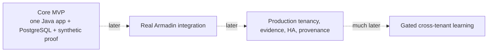

The MVP is a **product-value demonstration**. It is not a production-scale,
privacy, authorization, or security-boundary validation.

---

## 28. Glossary

| Term | Meaning |
|---|---|
| Engagement | One bounded period of security testing |
| E1 / E2 | Engagement 1 and Engagement 2 |
| `SourceEvent` | Versioned input envelope from the fixture runner or future adapter |
| Trusted context | Tenant and engagement identity supplied outside untrusted payload JSON |
| Source stream | Ordered event sequence belonging to one tenant and engagement |
| Canonical hash | Server-computed SHA-256 of canonical source-event bytes |
| Idempotency | Retrying the same committed event produces no additional effect |
| Conflict | Reusing an identity or position with different content |
| Atomicity | All writes in an operation commit together or all roll back |
| Canonical asset | Stable Deployment identity independent of changing Pod details |
| Asset observation | Time-specific evidence about the Deployment and its current Pod/network details |
| Finding | Stable weakness identity across engagements |
| Finding occurrence | Positive fact that a stable finding was detected |
| Test attempt | Coverage fact describing what check ran and how it ended |
| Verification key | Opaque identifier for the kind of check being compared |
| Relevant-context hash | Hash of stable security-relevant check context |
| Compatible negative | Exact matching completed test with `not_detected` result |
| Knowledge boundary | Explicit finalized source positions visible to one query |
| Fold | Pure function that reduces ordered facts into longitudinal meaning |
| Last verified exposure | Carried durable state: open or verified resolved |
| Current assessment | What the current engagement established |
| Episode classification | One of the six labels describing current-engagement change |
| Stateless view | Report using only E2 facts |
| Memory view | Report using E1 and E2 facts |
| Leakage | Letting future results or runner-only answers enter planner input |
| Replay | Reprocessing recorded source events or rereading facts |
| Semantic digest | Hash of meaning-bearing canonical data, excluding operational randomness |

---

## 29. A junior engineer's first-day checklist

1. Read this guide once without trying to memorize every constraint.
2. Read `mahoraga-mvp.md` for authoritative product behavior.
3. Read the stack and dependency-chain sections of
   `mahoraga-mvp-implementation-plan.md`.
4. Open the task file assigned to you and its prerequisite completion records.
5. Follow one sample `SourceEvent` from JSON through validation, hash,
   `source_events`, and its derived fact table.
6. Inspect the Flyway migration to understand which invariants PostgreSQL owns.
7. Trace one finding through E1, E2, the knowledge boundary, and the fold.
8. Run the focused tests named by your task.
9. Run the full existing `./mvnw verify` suite.
10. Implement only the current task and follow `AGENTS.md`.

The most useful mental sentence is:

> Mahoraga stores immutable, tenant-safe facts; selects only facts visible at an
> explicit completed boundary; orders them by domain time; and folds them into
> honest longitudinal posture and a better next plan.
